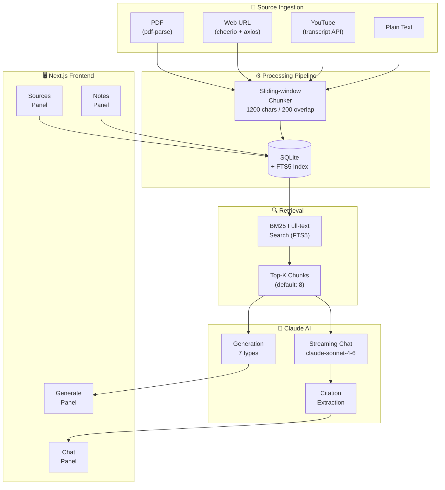
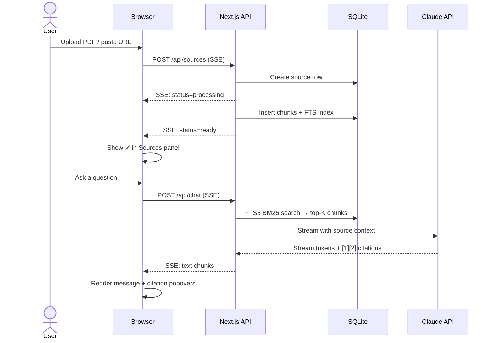

<div align="center">


<br />
<br />

**The open-source NotebookLM alternative — powered by Claude AI.**  
Upload sources, chat with your documents, generate insights. 100% local. No limits.

<br />

[](https://nextjs.org)
[](https://typescriptlang.org)
[](https://anthropic.com)
[](https://tailwindcss.com)
[](https://sqlite.org)
[](LICENSE)
[](https://github.com/ArttuAn/notegenius/stargazers)

</div>

---

## Why NoteGenius?

| | NoteGenius | NotebookLM |
|--|--|--|
| **AI Model** | Claude Sonnet 4.6 (superior reasoning) | Gemini |
| **Self-hostable** | ✅ | ❌ |
| **Open source** | ✅ | ❌ |
| **Source limits** | ✅ Unlimited | ❌ 50 |
| **Citation popovers** | ✅ Shows exact passage on click | ⚠️ Basic |
| **Notes panel** | ✅ Markdown, pinnable, auto-save | ⚠️ Limited |
| **Generation types** | ✅ 7 types | ⚠️ Fewer |
| **Data ownership** | ✅ Local SQLite, your machine | ❌ Google cloud |
| **Dark mode** | ✅ Built-in | ❌ |
| **Cost** | ✅ Pay-per-token (Claude API) | ❌ Google account |

---

## Features

### 📂 Multi-format Sources
Upload **PDFs**, paste **plain text**, add **web article URLs**, or drop in a **YouTube link** — transcripts are fetched automatically. All content is chunked and indexed in SQLite FTS5 for fast retrieval.

### 💬 Grounded Chat with Inline Citations
Ask anything about your documents. Every answer cites its sources with `[1]` markers. **Click any citation** to see the exact passage from the original document in a popover — not just the source name.

### ✨ 7 AI Generation Types
| Type | Description |
|------|-------------|
| **Summary** | Executive summary across all sources |
| **FAQ** | 8–12 likely reader questions with answers |
| **Study Guide** | Key concepts, definitions & practice questions |
| **Timeline** | Chronological event extraction |
| **Key Topics** | Top themes with supporting evidence |
| **Concept Map** | Hierarchical idea relationships |
| **Podcast Script** | Two-host dialogue (Host A / Host B) |

All generations stream in real-time and are saved to your notebook.

### 📝 Notes Panel
Write Markdown notes alongside your research. Auto-saves as you type, supports pinning, and keeps everything per-notebook.

---

## Architecture



---

## Data Flow



---

## Tech Stack

```
Frontend          Backend           AI              Data
─────────         ────────          ──              ────
Next.js 16        Next.js API       Claude          SQLite
TypeScript        Routes            Sonnet 4.6      better-sqlite3
Tailwind v4       SSE streaming     @anthropic-ai   FTS5 BM25
Radix UI          better-sqlite3    /sdk            Sliding-window
Sonner toasts     pdf-parse                         chunking
next-themes       cheerio
                  youtube-transcript
```

---

## Getting Started

### Prerequisites
- **Node.js 18+**
- A **Claude API key** → [console.anthropic.com](https://console.anthropic.com)

### Install

```bash
git clone https://github.com/ArttuAn/notegenius
cd notegenius
npm install
```

### Configure

```bash
cp .env.example .env.local
```

Edit `.env.local`:
```env
CLAUDE_API_KEY=sk-ant-your-key-here
```

### Run

```bash
npm run dev
```

Open **[http://localhost:3000](http://localhost:3000)**. The SQLite database is created automatically at `./data/notegenius.db` on first run.

---

## Project Structure

```
notegenius/
├── app/
│   ├── api/
│   │   ├── chat/          # Streaming Q&A + session management
│   │   ├── generate/      # 7-type AI generation (SSE)
│   │   ├── notebooks/     # CRUD for notebooks
│   │   ├── notes/         # CRUD for notes
│   │   ├── settings/      # App settings
│   │   └── sources/       # Source ingestion (SSE)
│   ├── notebook/[id]/     # Workspace page
│   └── notebooks/         # Dashboard page
│
├── lib/
│   ├── ai/
│   │   ├── chat.ts        # FTS5 retrieval → Claude streaming + citation parsing
│   │   ├── generate.ts    # 7 generation types → Claude streaming
│   │   └── prompts.ts     # All system prompts
│   ├── db/
│   │   ├── schema.ts      # SQLite schema + TypeScript types
│   │   ├── migrate.ts     # Idempotent migrations
│   │   └── queries/       # Typed query helpers per entity
│   └── ingestion/
│       ├── chunker.ts     # Sliding-window text chunker
│       ├── pdf.ts         # pdf-parse v2 extraction
│       ├── url.ts         # cheerio web scraper
│       └── youtube.ts     # Transcript fetcher
│
└── components/
    ├── notebook/
    │   ├── ChatPanel.tsx      # Streaming chat + citation chips
    │   ├── SourcesPanel.tsx   # Source list + upload dialog
    │   ├── GeneratePanel.tsx  # Generation type selector + results
    │   └── NotesPanel.tsx     # Auto-saving markdown notes
    └── ui/                    # Radix UI primitives
```

---

## Environment Variables

| Variable | Required | Default | Description |
|----------|:--------:|---------|-------------|
| `CLAUDE_API_KEY` | ✅ | — | Anthropic API key |
| `DATABASE_URL` | ❌ | `./data/notegenius.db` | SQLite file path |

---

## License

MIT — use it, fork it, ship it.

---

<div align="center">

Built with [Claude Code](https://claude.ai/code) · Powered by [Anthropic Claude](https://anthropic.com)

</div>
